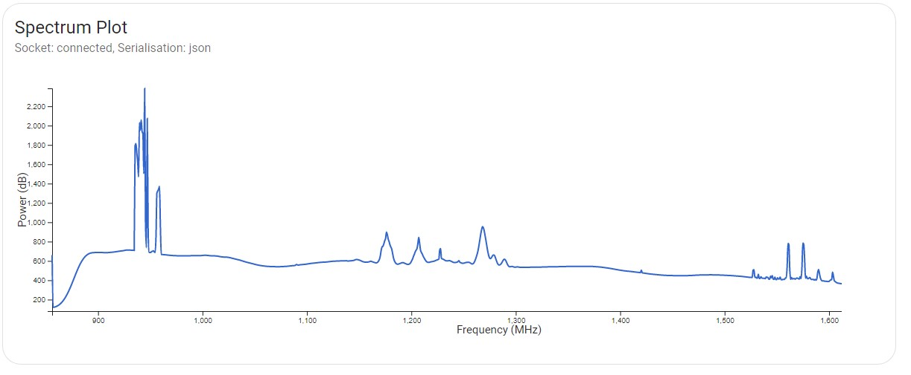
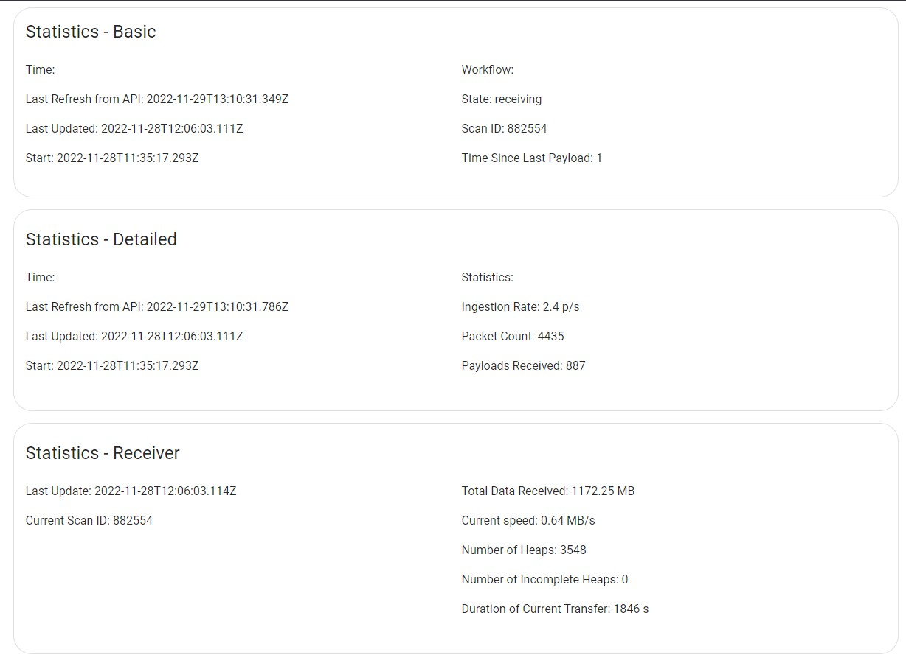

# SKAO QA Display

#Overview

This connects to the [QA data API](https://gitlab.com/ska-telescope/ska-sdp-qa-data-api) via a WebSocket and visualises the received QA metrics (e.g, spectrum plot, waterfall plot etc) in real-time.

# Getting Started

**To get the QI Display running services should be started in the following order:**

**Step 1:** Follow the steps in the [QA Data API](https://gitlab.com/ska-telescope/ska-sdp-qa-data-api) README to:
**Step 2** Then start [QA Metric Generator](https://gitlab.com/ska-telescope/ska-sdp-qa-metric-generator) using information in it's README.\
**Step 3:** Finally start the [SKAO QA Display](https://gitlab.com/ska-telescope/sdp/ska-sdp-qa-display) in this repository, using the steps below.\
**Sending spoof data to display:** Consult the README in the [metric-generator](https://gitlab.com/ska-telescope/ska-sdp-qa-metric-generator/-/tree/main/metric-generator) folder.

## Option-1: Using Container

```bash
docker-compose up -d
docker-compose ps
```

The docker container's working/source directory `/usr/src/app` is mapped/mounted to the host's `./` folder.

## Option-2: Start Locally

Follow the instructions below to start the React app in your host machine.

Prerequisite

- Node.js 16+
- React.js 18+
- material UI ( MUI )

```bash
# install the dependencies
yarn

# run the app in development mode.
yarn dev

# run the app in production mode
yarn start
```

Open [http://localhost:3333](http://localhost:3333) to view the UI in a browser.

## References

- Using React [MUI](https://mui.com)

### Project Structure

```
├── __test__
├── public
│   ├── favicon.ico
│   ├── index.html
│   ├── manifest.json
│   ├── robots.txt
│   └── static
│       └── ****                        /* Static Images */
├── src
│   ├── App
│   │   ├── App.test.tsx
│   │   └── App.tsx
│   ├── components
│   │   ├── rfi
│   │   │   └── rfi.tsx
│   │   ├── spectrogram
│   │   │   ├── spectrogram.test.tsx
│   │   │   └── spectrogram.tsx
│   │   ├── spectrumPlot
│   │   │   ├── spectrumPlot.test.tsx
│   │   │   └── spectrumPlot.tsx
│   │   └── statistics
│   │       ├── statistics.test.tsx
│   │       └── statistics.tsx
│   ├── index.scss
│   ├── index.tsx
│   ├── libs                            /* the visualisation functions */
│   │   └── ****
│   ├── mockData                        /* Mock Data for testing */
│   │   └── ****                        
│   ├── models                          /* different data models */
│   │   └── ****
│   ├── theme
│   │   └── index.js                    /* MUI theme */
│   ├── types
│   │   └── ****
│   └── utils
│       └── ****
└── ****
```

[1] The package.json files lists all the packages and libraries used in this project.

[2] To our knowledge, none of the packages or libraries used in this project require any license. Please let us know if any package or component require license or acknowledgement.


# Screenshots

Screenshots of the visulisation functions implemented.

The appearance of the plots depends on the dataset analysed. Thus, plots generated using are generally expected to look different from the ones included below. Getting plots with different appearance when first setting up and testing the [SKAO QA Display](https://gitlab.com/ska-telescope/sdp/ska-sdp-qa-display), [QA Data API](https://gitlab.com/ska-telescope/ska-sdp-qa-data-api) and [QA Metric Generator](https://gitlab.com/ska-telescope/ska-sdp-qa-metric-generator) is not a cause for concern.

|                                                                 |                                                           |
| --------------------------------------------------------------- | --------------------------------------------------------- |
|          |     |
| Fig. 1: Spectrograms of different baselines and polarisations\* | Fig. 2: Waterfall (top -> bottom) plot of a spectrogram\* |
|              |      |
| Fig. 3: Spectrum plot\*                                         | Fig. 4: Statistics\*                                      |

_\*The spectrum plot and spectrograms are generated using data from Meerkat telescope_
