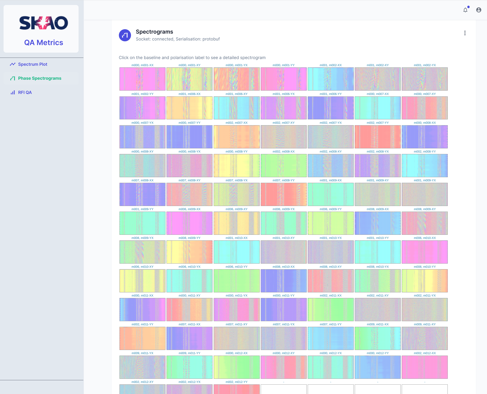
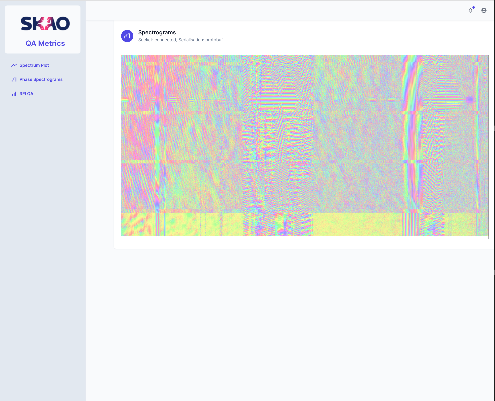
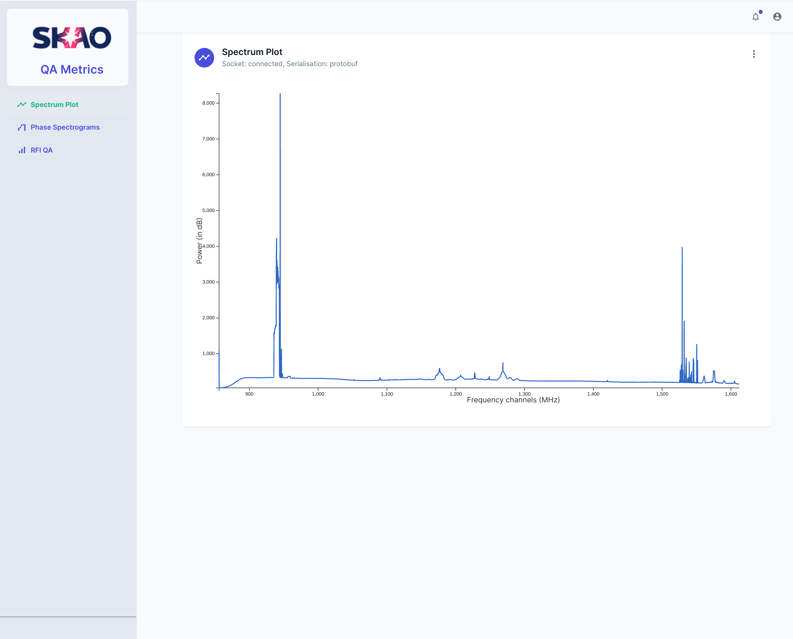
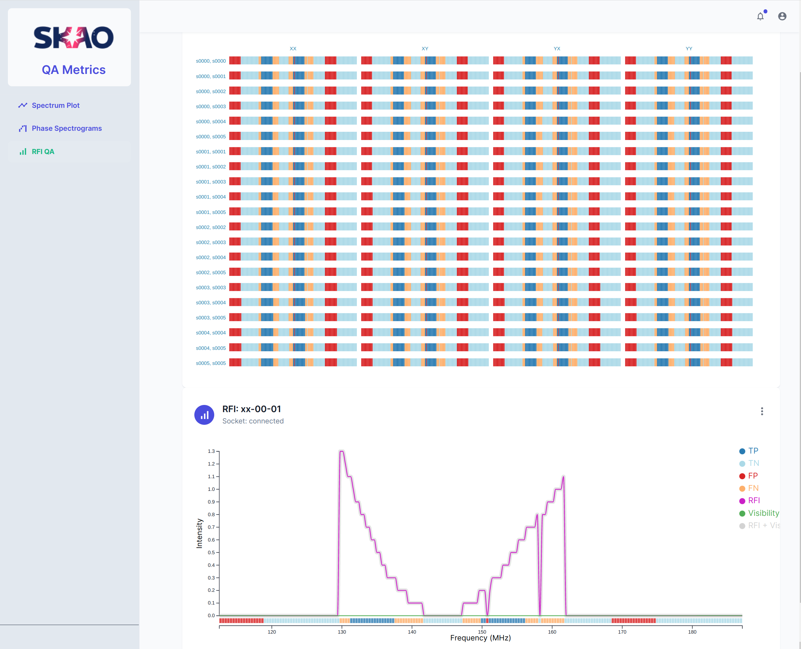

# QA Display

This connects to the [QA data API](https://gitlab.com/ska-telescope/ska-sdp-qa-data-api) on a socket and visualizes the received metrics (e.g, spectrum plot, waterfall plot etc) in real-time.

# Getting Started

**To get the QI Display running services should be started in the following order:**

**Step 1:** Follow the steps in the [QA Metric Generator](https://gitlab.com/ska-telescope/ska-sdp-qa-metric-generator) README to:
\
(1) create the `"ska-sdp-qa-metric-network"` -> (2) start Message Broker -> (3) Start Metric Generator\
**Step 2** Then start [QA Data API](https://gitlab.com/ska-telescope/ska-sdp-qa-data-api) using information in it's README.\
**Step 3:** Finally start the [QA Display](https://gitlab.com/ska-telescope/sdp/ska-sdp-qa-display) in this repository, using the steps below.\
**Sending spoof data to display:** Consult the README in the [metric-generator](https://gitlab.com/ska-telescope/ska-sdp-qa-metric-generator/-/tree/main/metric-generator) folder.

## Option-1: Using Container

```bash
docker-compose up -d
docker-compose ps
```

The docker container's working/source directory `/usr/src/app` is mapped/mounted to the host's `./` folder.

## Option-2: Start Locally

Follow the instructions below to start the React app in your host machine.

Prerequisite

- Node.js 16+

```bash
# install the dependencies
yarn

# run the app in development mode.
yarn dev
```

Open [http://localhost:3000](http://localhost:3000) to view the UI in a browser.

## References

- Using [Next.js](https://nextjs.org) build system
- Using React [MUI](https://mui.com)

### Project Structure, Packages, and Licenses

```
├── __test__                            /* unit tests following Next.js guidelines */
├── package.json                        /* list of used packages and libraries */
├── public
│   ├── index.html
│   └── manifest.json
├── src
│   ├── components
│   │   ├── dashboard-layout            /* MUI open-source */
│   │   │   ├── dashboard-layout.tsx
│   │   │   ├── dashboard-navbar.tsx
│   │   │   ├── dashboard-sidebar.tsx
│   │   │   └── nav-item.tsx
│   │   └── ****                        /* react components */
│   ├── libs                            /* the visualisation functions */
│   │   └── css
│   │       └── ****                    /* stylesheets related to the visualisations */
│   ├── mock
│   │   └── ****                        /* mock data used for testing */
│   ├── models
│   │   └── ****                        /* different data models */
│   ├── pages
│   │   ├── _app.tsx                    /* Next.js specific */
│   │   ├── _document.tsx               /* Next.js specific */
│   │   ├── index.tsx
│   │   └── ****                        /* all pages */
│   ├── theme
│   │   └── index.js                    /* modify this for to apply style/template */
│   └── utils
│       ├── create-emotion-cache.js     /* MUI open-source */
│       └── get-initials.js
└── ****                                /* other files */

```

[1] In this repository, we adapted (e.g., updated code for our requirement, language type JS to TS etc.) around nine files of total ~600 lines of code from `/* MUI open-source */`. These are mainly used for side navigation, top navigation, and theme (see the screenshot at the end of this doc). These files can be used freely, see the [license](https://github.com/devias-io/material-kit-react/blob/main/LICENSE.md). This is a data visualisation project and not a general web-development project, therefore it will be a waste of our effort to spend time on something which is already available. Moreover, as we keep developing our visualisation components, these files contents will evolve, for example, add SKA specific styles.

[2] The package.json files lists all the packages and libraries used in this project. Mainly the Google's Material design, [MUI](https://mui.com/) provides beautiful UI components (e.g., buttons, check boxes, cards, etc.) which are open source and free to use.

[3] To our knowledge, none of the packages or libraries used in this project require any license. Please let us know if any package or component require license or acknowledgement.

## Notes

- The source code is a proof of concept, and will gradually evolve.

# Screenshots

Screenshots of the visulisation functions implemented.
The appearance of the plots depends on the dataset analysed. Thus, plots generated using are generally expected to look different from the ones included below. Getting plots with different appearance when first setting up and testing the [QA Display](https://gitlab.com/ska-telescope/sdp/ska-sdp-qa-display), [QA Data API](https://gitlab.com/ska-telescope/ska-sdp-qa-data-api) and [QA Metric Generator](https://gitlab.com/ska-telescope/ska-sdp-qa-metric-generator) is not a cause for concern.

|                                                                 |                                                           |
| --------------------------------------------------------------- | --------------------------------------------------------- |
|          |     |
| Fig. 1: Spectrograms of different baselines and polarisations\* | Fig. 2: Waterfall (top -> bottom) plot of a spectrogram\* |
|              |             |
| Fig. 3: Spectrum plot\*                                         | Fig. 4: RFI QA\*                                          |

_\*The spectrum plot and spectrograms are generated using data from Meerkat telescope, and the RFI QA is generated using simulated data._
