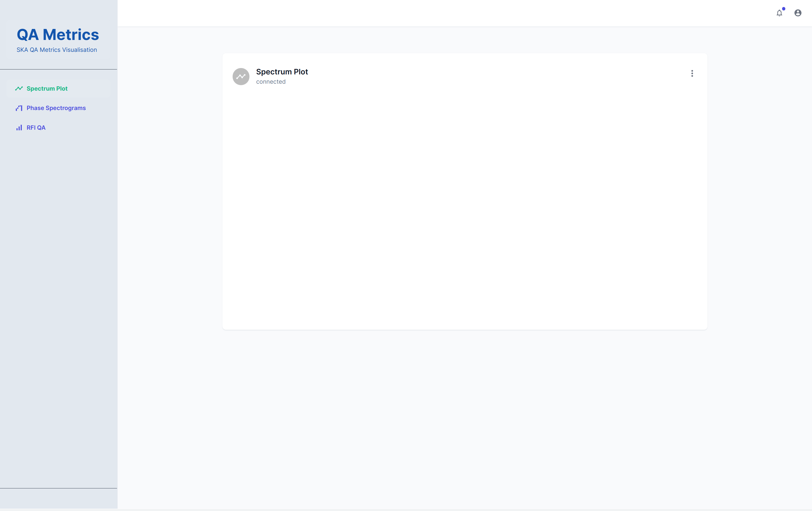

# QA Display

This connects to the [QA data API](https://gitlab.com/ska-telescope/ska-sdp-qa-data-api) on a socket and visualizes the received metrics (e.g, spectrum plot, waterfall plot etc) in real-time.

# Getting Started

## Option-1: Using Container

_Note: There is a known issue._

```bash
docker-compose up -d
docker-compose ps
```

The docker container's working/source directory `/usr/src/qa-display` is mapped/mounted to the host's `./` folder. Therefore, attaching a VSCode editor to the `qa-display` container is a most convenient way to develop and debug.

During development and debugging, the `react-scripts` will automatically reload the changes. Open [http://localhost:3000](http://localhost:3000) to view the UI in the browser, and use a Chrome debugger to debug.

## Option-2: Start Locally

Follow the instructions below to start the React app in your host machine.

Prerequisite

- Node.js 14+

```bash
## install the dependencies
yarn

## run the app in development mode.
yarn dev
```

Open [http://localhost:3000](http://localhost:3000) to view the UI in a browser.

## References

- Using [Next.js](https://nextjs.org) build system
- Using React [MUI](https://mui.com)

### Third party packages, libraries and licenses

```
├── ****                                /* various configuration files */
├── package.json                        /* list of used packages and libraries */
├── public
│   ├── index.html
│   └── manifest.json
├── src
│   ├── components
│   │   ├── dashboard-layout            /* MUI open-source */
│   │   │   ├── dashboard-layout.tsx
│   │   │   ├── dashboard-navbar.tsx
│   │   │   ├── dashboard-sidebar.tsx
│   │   │   ├── nav-item.tsx
│   │   │   └── severity-pill.tsx
│   │   └── plots
│   │       └── ****                    /* plots as react component  */
│   ├── libs
│   │   └── css
│   │       └── ****                    /* CSS stylesheets */
│   ├── mock
│   │   └── ****                        /* mock data used for testing */
│   ├── models
│   │   └── ****                        /* different data models, basically for typing */
│   ├── pages
│   │   ├── _app.tsx                    /* MUI open-source */
│   │   ├── _document.tsx               /* MUI open-source */
│   │   ├── index.tsx
│   │   └── plot
│   │       └── ****                    /* all pages  */
│   ├── theme
│   │   └── index.js                    /* MUI open-source */
│   └── utils
│       ├── create-emotion-cache.js     /* MUI open-source */
│       └── get-initials.js
├── tsconfig.json
└── yarn.lock

```

[1] In this repository, we adapted (e.g., updated code for our requirement, language type JS to TS etc.) around nine files of total ~600 lines of code from `/* MUI open-source */`. These are mainly used for side navigation, top navigation, and theme (see the screenshot at the end of this doc). These files can be used freely, see the [license](https://github.com/devias-io/material-kit-react/blob/main/LICENSE.md). This is a data visualisation project and not a general web-development project, therefore it will be a waste of our effort to spend time on something which is already available. Moreover, as we keep developing our visualisation components, these files contents will evolve, for example, add SKA specific styles.

[2] The package.json files lists all the packages and libraries used in this project. Mainly the Google's Material design, [MUI](https://mui.com/) provides beautiful UI components (e.g., buttons, check boxes, cards, etc.) which are open source and free to use.

[3] To our knowledge, none of the packages or libraries used in this project require any license. Please let us know if any package or component require license or acknowledgement.

## Screenshot of the UI



## Notes and Other Known Issues

- The Dockerfile need to be fixed to run in a container, however, locally developing and debugging is is much more faster.
- The source code is still a proof of concept, and should gradually improve.
