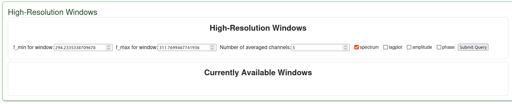
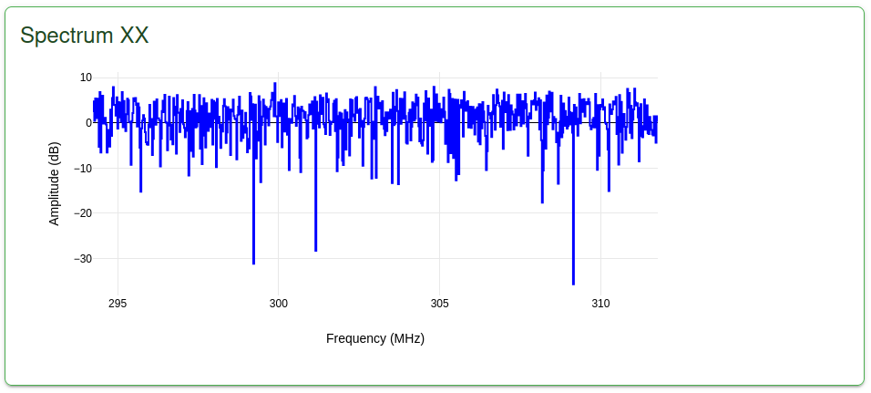

High-Resolution Windows
-----------------------

By default, the signal metrics are computed using a channel averaging window of 50 channels. 
This default value is configurable in the assign_resources json. The reason for this is to 
reduce the volume of data being sent over the API and to lower the workload on the browser.

.. code-block:: JSON
    "signal_display": {
                        "metrics": [
                            "all"
                        ],
                        "nchan_avg": 50,
                        "window_count": 5,
                        "rounding_sensitivity": 10
                    }

Should you need greater resolution for a particular frequency window, it is possible to 
request a 'high-resolution' window via the signal display. 

Open up the High-Resolution window tab, pictured above. You can click and drag on the spectrum 
plots to select a frequency range, or manually enter your window of interest. 
Then, define the amount of channel averaging you desire and the metrics for which you would 
like to see in higher resolution and submit your request.

This will open up new plots displaying your selected frequency range and the new values of 
channel averaging, allowing you to inspect the data with greater fidelity.

