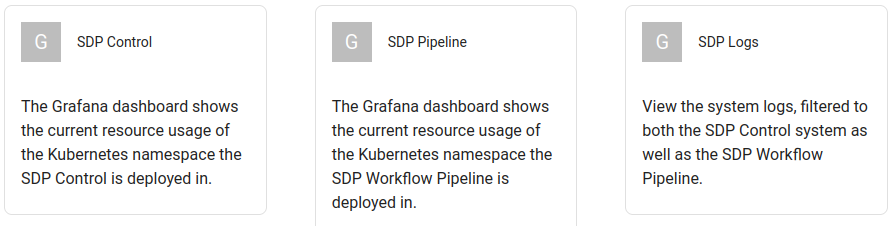

External Links
==============

The display links out to a few external dashboards that are useful for monitoring the core of the system.

These links described on this page is also in the deployed Dashboard, and the namespaces are updated as required.

The links are found at the top of the page as ``Grafana SDP Dashboard``, ``Grafana Pipeline Dashboard``, and ``Kibana Logs``.

These links are generated from an API call, so if there are changes they will update as required.

Resource Usage
--------------

We are using Grafana to monitor our resource usage. There is a dashboard that is available for use directly, and can be used to monitor both the Deployed Namespace, and the Processing Namespace.

The link to go to the current dashboard can be found `in Grafana here <https://k8s.stfc.skao.int/grafana/d/dad0e09f-32f5-4181-b273-c7a1017221ff/kubernetes-resource-monitoring-dashboard?orgId=1&refresh=5s>`_.

That link can be used for both namespaces, and can be used for any of the clusters (update the cluster selection to change).

Logs
----

The logs for the deployed system can be found in Kibana and can be accessed
`here <https://k8s.stfc.skao.int/kibana/app/discover#/?_g=(filters:!(),refreshInterval:(pause:!t,value:0),time:(from:now-15m,to:now))&_a=(columns:!(kubernetes.namespace,kubernetes.pod.name,kubernetes.container.name,message),filters:!(),grid:(columns:(kubernetes.container.name:(width:(width:120)),kubernetes.namespace:(width:(width:120)),kubernetes.pod.name:(width:(width:150)))),index:cbb05bec-ed81-45f8-b11a-eab26a3df6b1,interval:auto,query:(language:kuery,query:'kubernetes.namespace:%20%22dp-shared%22%20or%20kubernetes.namespace:%20%22dp-shared-p%22'),sort:!(!('@timestamp',desc)))>`_.
