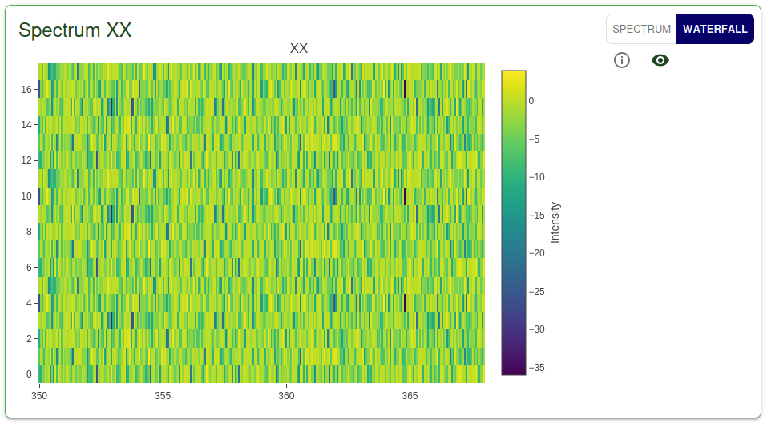
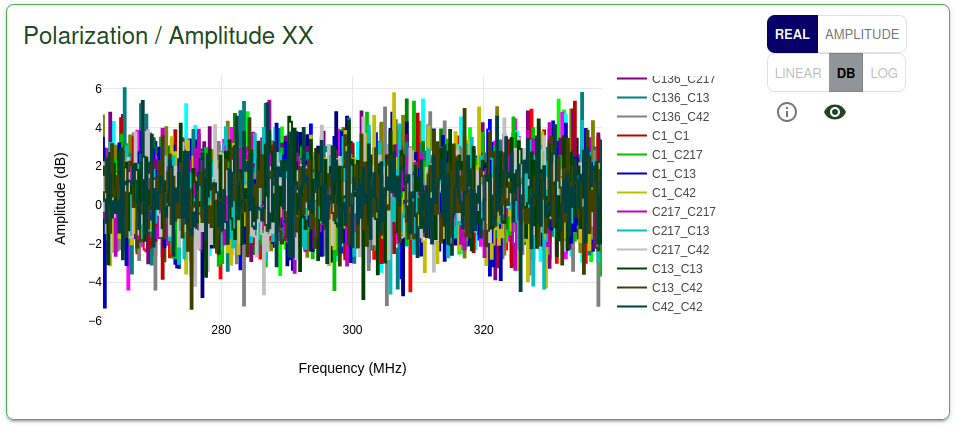
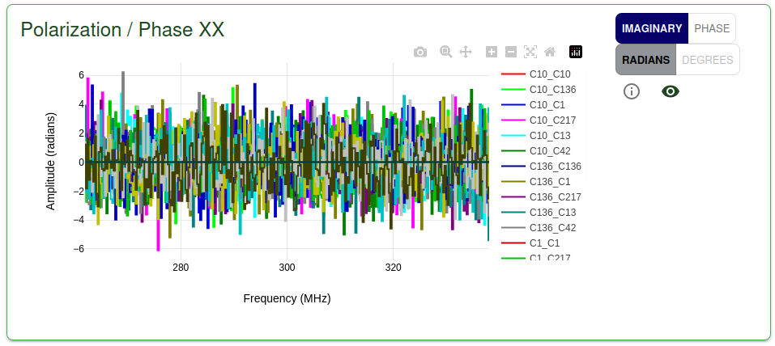
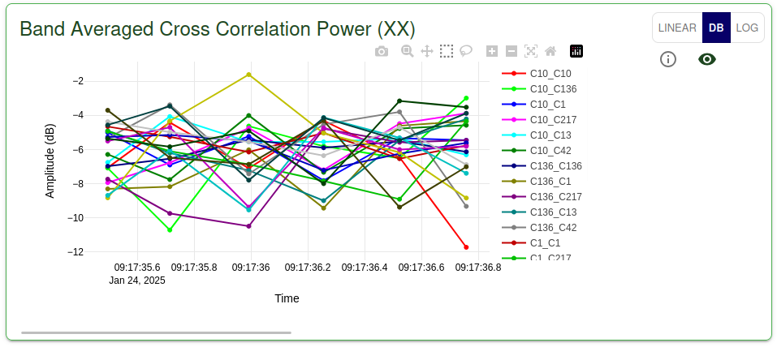
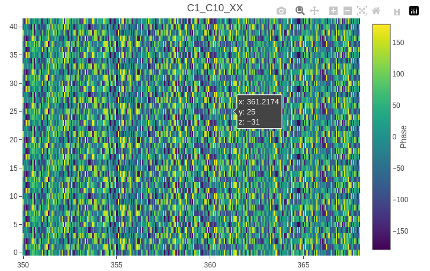
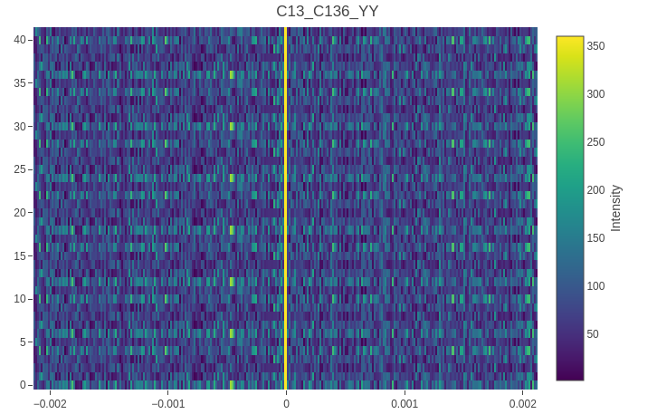
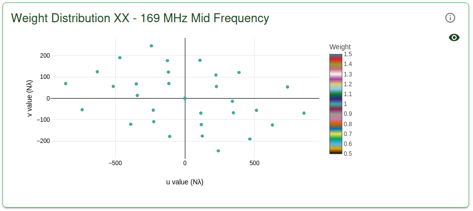
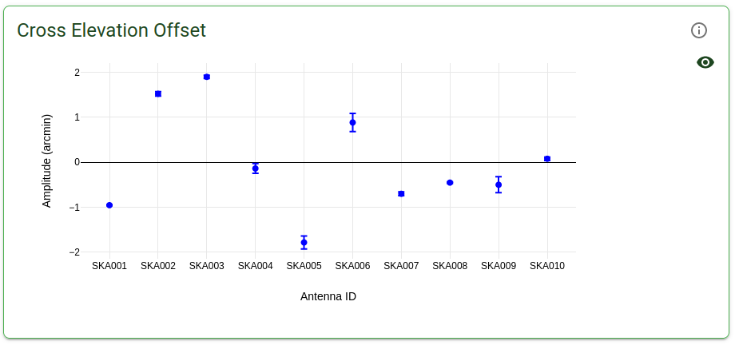
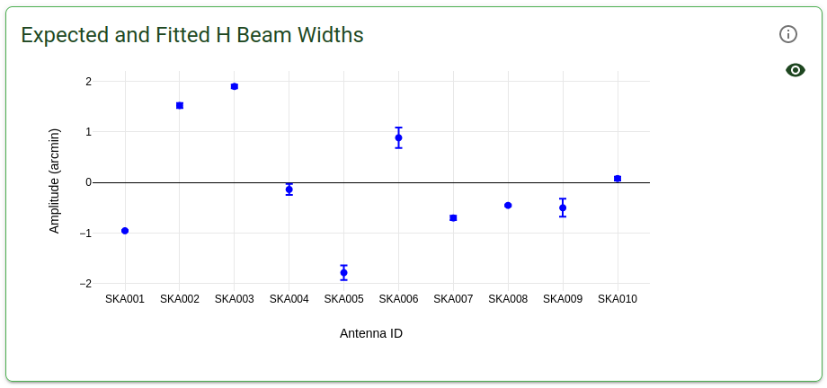
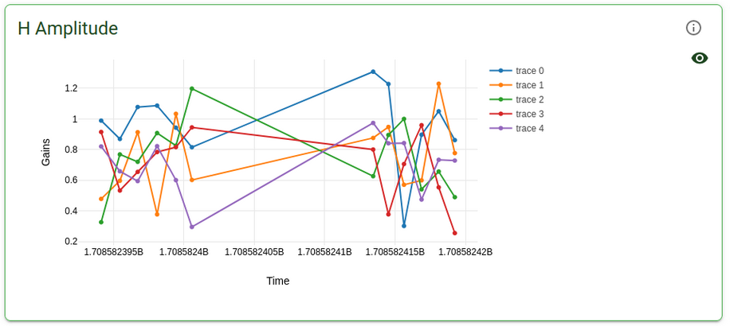

Available Graphs
================

The signal display provides a number of key visualisations of the data. The plots are separated between 
two tabs; "Visibility Receive", which houses the real time visualisation of incoming data, and "Calibration Data",
which holds the outputs of the calibration pipelines.

Visibility Receive
-----------------

Below are the descriptions of each plot in the Visibility Receive tab and how they respond.

Spectrum
--------

The incident flux on the telescope is distributed over a finite receiving band, and is a function of
frequency. The spectrum is the flux per unit bandwidth. The broad continuum spectrum of a radio source
may contain a number of spectral lines, whose profiles are the subject of detailed study. However, a 
receiver bandpass is usually wide enough to contain one or more spectral lines, and so we sub-divide 
the band into a number of filter channels.

A digital autocorrelation spectrometer samples the input signal at the Nyquist frequency, producing a 
series of binary packets representing the signal in time. The signal is then delayed by a series of 
identical values, or lags, such that the inputs to the multipliers are the signal itself and a series 
of delayed signals. 

Sampling of the output provides an estimate of the discrete autocorrelation function. Once noise has
been accounted for, the autocorrelation function is related to the power spectrum by the Discrete 
Fourier Transform.

Here, we present a plot of the mean autospectrum averaged over all channels and baselines, per 
polarisation.

.. image:: images/spectrum.png
   :width: 100%

The scale of the y-axis can be changed between linear, decibels and logarithmic using the buttons in 
the top right corner of the plot view. Additionally, one can switch between a 'live' view and a 'waterfall' 
plot, showing historical spectrum data from the Redis store.

Power vs Phase
--------------

For each baseline and polarisation a plot of the amplitude of the visibility spectrum is displayed, 
along with a plot of the phase of the visibility spectrum. From the plot of the amplitude it is 
possible to discern whether a source is resolved, along with information about its shape. The phase 
information allows us to determine the source's offset from the phase center.

This plot is able to show the amplitude, or the real component of the visibility 
spectrum, selectable via the button in the top right corner of the plot view. When viewing the amplitude, 
the scale of the y-axis can be changed between linear, decibels and logarithmic using the buttons in 
the top right corner of the plot view (it is not possible to take the logarithm of a negative number, and 
so it is disabled when viewing the real components of the visibility spectrum).

This plot is able to show the phase, or the imaginary component of the visibility 
spectrum, selectable via the button in the top right corner of the plot view. When viewing the phase, 
the scale of the y-axis can be changed between radians and degrees using the buttons in 
the top right corner of the plot view (this action is disabled when viewing the imaginary component).

Band Averaged Cross Correlation Power
-------------------------------------

For each polarisation and baseline, a plot of the band averaged cross correlation power is displayed 
as a time series. The scale of the y-axis can be changed between linear, decibels and logarithmic using 
the buttons in the top right corner of the plot view.

Spectrogram Waterfall
---------------------

A visibility is the correlation between two antennas over a time and frequency interval. A lag or XF
correlator multiplies (X) the signals from each antenna together as a function of lag.

.. image:: images/lag_X.png
   :width: 400

This can be integrated for multiple time steps and is what an XF correlator outputs. However, the
contributions from all the channels are mixed together, and so to extract the information about the
power in each channel, we Fourier transform (F) this signal (and this is where the F in XF comes
from).

.. image:: images/freq_X.png
   :width: 400

This is the Cross-Correlation power as a function of frequency and it is what we get from our
correlator.

For each baseline and polarisation, we present a waterfall plot of the phases of the visibilities as 
a function of frequency. A flat spectrum of phases is synonymous with zero residual delay. This is 
due to the 'Shift Theorem' which states that a delay in the time domain corresponds to a linear phase 
term in the frequency domain.

Cross-Correlation Power vs Time Lag
-----------------------------------

The output of our Correlator is the Cross-Correlation power as a function of frequency (see above), 
and furthermore it is an FX correlator, performing the Fourier transform before the
multiplication. To change this back to "Cross-Correlation power as a function lag" we need to
calculate the inverse Fourier transform (iFFT) of the visibilities for each baseline.

We present this calculation in the form of a Waterfall plot. For each baseline and timestep, the
iFFT of the complex visibility spectrum is calculated.

Any residual delay will manifest itself as a shift of the peak of the lag plot away from zero. I.e.,
if the signals have been correctly delayed before their Cross-Correlation the peak power in
Cross-Correlation will be at zero lag.

Weight Distribution and UV-Coverage Plots
-----------------------------------------
An interferometer measures components of the sky Fourier Transform through the sampling of the Visibility 
function V. These samples live in (u, v, w) space and are often projected into a plane, the uv-plane.
We present the weight distribution W(u, v) as a time series plot, showing how the uv-plane gets filled 
in with the earth's rotation.

Calibration Data
----------------

Descriptions of each plot in the Calibration Data tab and how they respond follows.

The pointing offset calibration pipeline fits 2D Gaussian primary beams to the visibility or gain 
amplitudes. Each scan is split into a number of frequency chunks, and the primary beam is fitted 
for each frequency chunk and dish. The weighted average of the fitted parameters for each frequency 
chunk is provided for each antenna.

Elevation and Cross-elevation offset
------------------------------------

The fitted parameter representing the centre of the primary beam provides the elevation
and Cross-elevation offsets, along with their standard deviations. If a calculated pointing offset exceeds 
a threshold percentage of the expected value, then it is discounted. These discounted pointing offsets 
are indicated by the red shaded regions in the graphs.

Beam width
----------

The expected and fitted widths of the 2D gaussian primary beam are displayed, along with their 
standard deviations.

Beam height
-----------

The expected and fitted heights of the 2D gaussian primary beam are displayed, along with their 
standard deviations.

.. image:: images/beam-height.png
   :width: 400

Gain Calibration
----------------

In radio telescopes, the complex receiver gains are initially unknown and need to be calibrated.
Measured interferometer data is generally corrupted by instrumental and atmospheric effects, which
can be corrected for through a process known as gain calibration. Gain calibration enhances the 
quality of astronomical images and improves the effectiveness of signal processing techniques.

Since the antenna gains are unknown prior to observing the field of interest, science scans are typically
interspersed with calibrator scans of high SNR, well-modelled objects. By determining the major factors
influencing the antenna gains, and applying the inverse to the target field, we can produce corrected data
that can act as the starting point for self calibration.

In order to assess the stability of the gain calibration solution with time, we present a time-series plot
of the amplitude and phase of the complex gains, for each antenna. Currently, only the first frequency 
channel is displayed.

