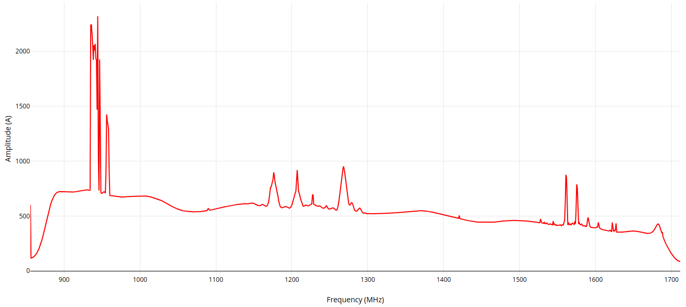
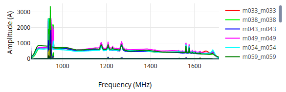
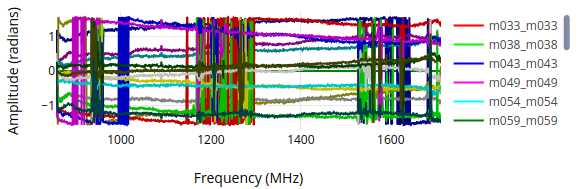
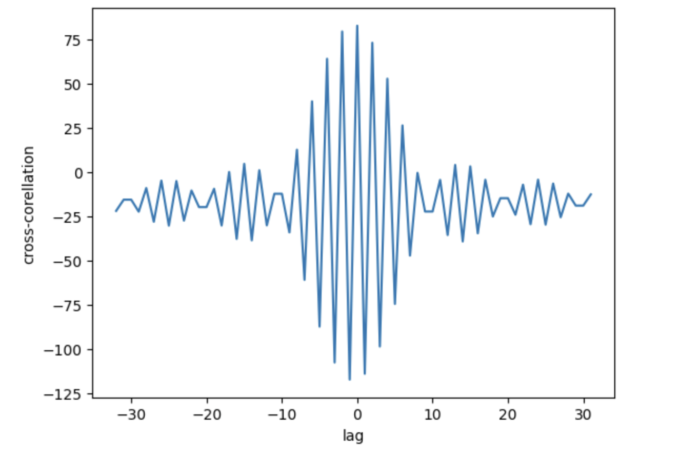
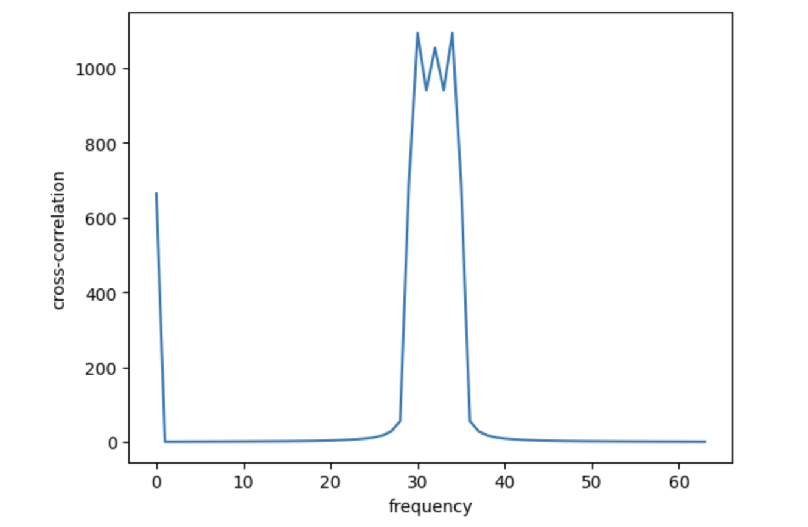
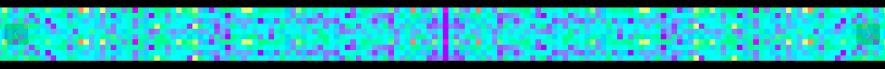

Available Graphs
================

There are quite a few different graphs available. Descriptions of each and how they respond follows.

Spectogram
----------

Power vs Phase
--------------

Spectrum Waterfall
------------------

Cross-Correlation Power vs Time Lag
-----------------------------------

A visibility is the correlation between two antennas over a time and frequency interval. A lag or XF
correlator multiplies (X) the signals from each antenna together as a function of lag.

This can be integrated for multiple time steps and is what an XF correlator outputs. However, the
contributions from all the channels are mixed together, and so to extract the information about the
power in each channel, we Fourier transform (F) this signal (and this is where the F in XF comes
from).

This is the Cross-Correlation power as a function of frequency and it is what we get from our
correlator. Our correlator is an FX correlator, performing the Fourier transform before the
multiplication. To change this back to "Cross-Correlation power as a function lag" we need to
calculate the inverse Fourier transform (iFFT) of the visibilities for each baseline.

We present this calculation in the form of a Waterfall plot. For each baseline and timestep, the
iFFT of the complex visibility spectrum is calculated.

Any residual delay will manifest itself as a shift of the peak of the lag plot away from zero. I.e.,
if the signals have been correctly delayed before their Cross-Correlation the peak power in
Cross-Correlation will be at zero lag.

