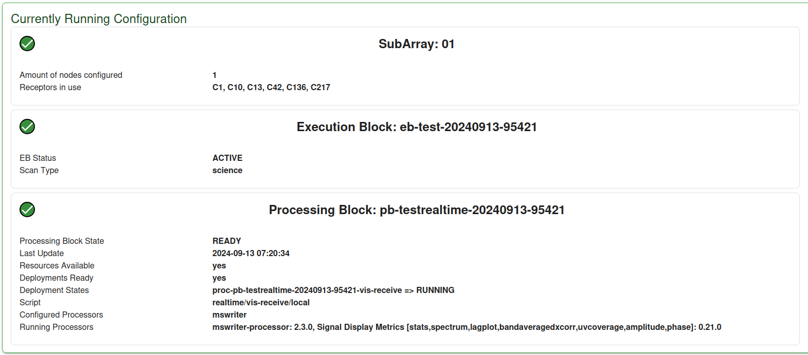

Configuration and Statistics
============================

The configuration of the currently running subarray is shown on the UI. This
includes information about the subarray's config, what is currently being observed,
and real-time statistics from the running visibility receive process.

Configuration Information
-------------------------

Once the subarray has been selected, the current configuration is retrieved
every 30 seconds to check the execution block and processing block
information.

Visibility Receive Statistics
-----------------------------

While the visibility receive process is running, the UI will display stats on the incoming data.

SPEED2 Statistics
-----------------

When the speed2 receiver is running we get statistics on the heaps that
are being received.

